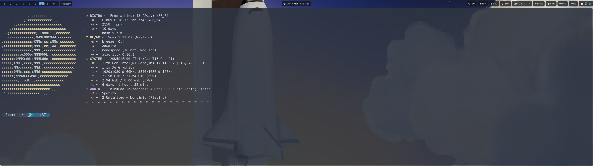

# Sway Fedora DotFiles

A complete Wayland desktop environment configuration for Fedora, built around the **Sway** tiling window manager. This setup features a dark Nordic/Nord-inspired theme, Vim-style keyboard navigation, and a developer-friendly workflow.



---

## ✨ Features

- **Sway** – Wayland tiling window manager with Vim-style navigation and systemd integration
- **Waybar** – Status bar with workspaces, clock, CPU/memory/disk/network, battery, volume, DNF update notifications, and system tray
- **Alacritty** – GPU-accelerated terminal with the Nordic color theme
- **Kitty** – Alternative terminal with the Nord color theme
- **Wofi** – Application launcher with a dark, styled UI
- **Mako** – Desktop notification daemon with Nord-inspired styling
- **Swaylock** – Lock screen with a custom wallpaper and visual feedback
- **Starship** – Fast, minimal shell prompt with Nord colors and Git/language indicators
- **Btop** – Real-time system resource monitor
- **Fastfetch** – System information display on shell start

---

## 📦 Prerequisites

Install the following packages on Fedora before applying these dotfiles:

```bash
sudo dnf install sway waybar alacritty kitty wofi mako swaylock swayidle \
    swaybg grimshot wl-clipboard cliphist playerctl brightnessctl \
    btop starship zoxide fastfetch lxqt-policykit sddm
```

> **Note:** Some packages may be available via [COPR](https://copr.fedorainfracloud.org/) or [Flatpak](https://flathub.org/) if they are not in the default Fedora repositories.

Install a [Nerd Font](https://www.nerdfonts.com/) for icons in Waybar and the terminal. This config uses **MesloLGS Nerd Font Mono**.

---

## 🚀 Installation

1. **Clone the repository:**

   ```bash
   git clone https://github.com/Albert-LGTM/Sway-Fedora-DotFiles.git
   cd Sway-Fedora-DotFiles
   ```

2. **Back up any existing configuration files you want to keep:**

   ```bash
   cp -r ~/.config/sway ~/.config/sway.bak
   # Repeat for waybar, alacritty, kitty, wofi, mako, swaylock, btop, etc.
   ```

3. **Copy the dotfiles to your home directory:**

   ```bash
   cp .bashrc ~/
   cp .gitconfig ~/
   cp -r .config/* ~/.config/
   ```

   Or use symbolic links if you prefer to manage updates via Git:

   ```bash
   ln -sf "$(pwd)/.bashrc" ~/
   ln -sf "$(pwd)/.gitconfig" ~/
   for dir in .config/*/; do
       ln -sf "$(pwd)/$dir" ~/.config/
   done
   ```

4. **Log out and select Sway** from your display manager, or start it directly:

   ```bash
   sway
   ```

---

## ⌨️ Key Bindings

The modifier key is **Super** (Windows key).

### General

| Shortcut | Action |
|---|---|
| `Super + Return` | Open terminal (Alacritty) |
| `Super + D` | Open application launcher (Wofi/Rofi) |
| `Super + Shift + Q` | Close focused window |
| `Super + Ctrl + L` | Lock screen (Swaylock) |
| `Super + Shift + E` | Exit Sway |
| `Super + Shift + R` | Reload Sway config |

### Navigation

| Shortcut | Action |
|---|---|
| `Super + H/J/K/L` | Move focus (Vim-style: left/down/up/right) |
| `Super + Shift + H/J/K/L` | Move window |
| `Super + 1–9` | Switch to workspace 1–9 |
| `Super + Shift + 1–9` | Move window to workspace 1–9 |

### Layout

| Shortcut | Action |
|---|---|
| `Super + R` | Enter resize mode |
| `Super + F` | Toggle fullscreen |
| `Super + V` | Split vertically |
| `Super + B` | Split horizontally |

### Screenshots

| Shortcut | Action |
|---|---|
| `Print` | Screenshot entire screen |
| `Alt + Print` | Screenshot active window |
| `Ctrl + Print` | Screenshot selected region |

### Media & System

| Shortcut | Action |
|---|---|
| `XF86AudioPlay/Pause` | Play/pause media |
| `XF86AudioNext/Prev` | Next/previous track |
| `XF86AudioRaiseVolume/LowerVolume` | Adjust volume |
| `XF86AudioMute` | Toggle mute |
| `XF86MonBrightnessUp/Down` | Adjust screen brightness |
| `Super + Shift + V` | Open clipboard history (Cliphist + Rofi) |

---

## 🗂️ Configuration Overview

| Path | Description |
|---|---|
| `.config/sway/config` | Main Sway window manager config |
| `.config/sway/config.d/` | Modular Sway config snippets |
| `.config/sway/environment` | Wayland environment variables |
| `.config/waybar/config.jsonc` | Waybar layout and modules |
| `.config/waybar/style.css` | Waybar theme and styling |
| `.config/waybar/scripts/updates.sh` | DNF update count script (runs every 30 min) |
| `.config/alacritty/alacritty.toml` | Alacritty terminal settings |
| `.config/alacritty/nordic.toml` | Nordic color theme for Alacritty |
| `.config/kitty/kitty.conf` | Kitty terminal settings |
| `.config/kitty/nord.conf` | Nord color theme for Kitty |
| `.config/wofi/config` | Wofi launcher settings |
| `.config/wofi/style.css` | Wofi launcher styling |
| `.config/mako/config` | Mako notification daemon settings |
| `.config/swaylock/config` | Swaylock lock screen settings |
| `.config/btop/btop.conf` | Btop system monitor settings |
| `.config/starship.toml` | Starship prompt configuration |
| `.bashrc` | Bash shell aliases, functions, and exports |

---

## 🎨 Theme

The entire desktop uses a **Nordic/Nord** dark color palette:

| Role | Color |
|---|---|
| Background | `#13171b` (semi-transparent) |
| Accent / Border | `#5EA1C8` |
| Focused Window Border | `#5EA1C8` |
| Unfocused Window Border | `#252d33` |
| Critical Notification | `#e67e80` |

Fonts used:
- **MesloLGS Nerd Font Mono** – terminal and icons
- **IBM Plex Sans** – notifications

---

## 🔤 Keyboard Layout

The keyboard layout is set to **GB** and **DK**, with `Alt + Shift` to toggle between them. This can be changed in `.config/sway/config`.

---

## 📜 License

This repository does not currently include a license. All configuration files are provided as-is for personal use and inspiration.
